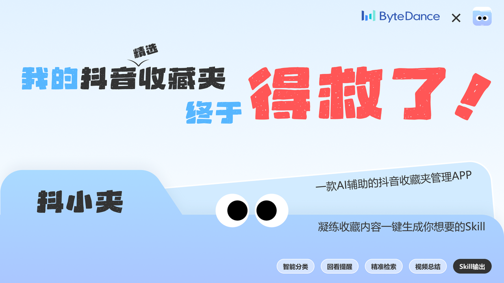
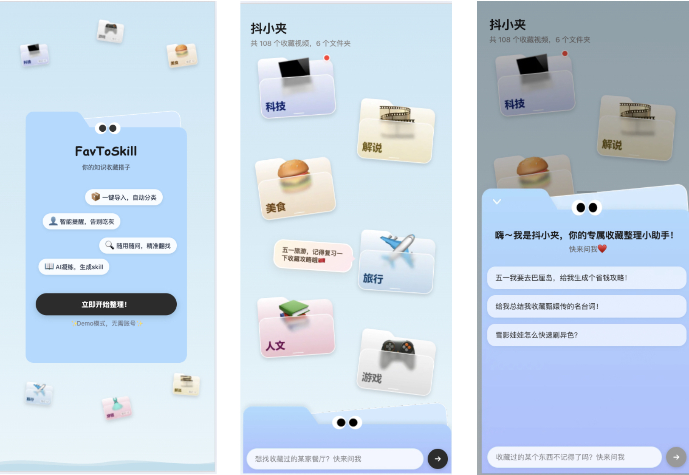
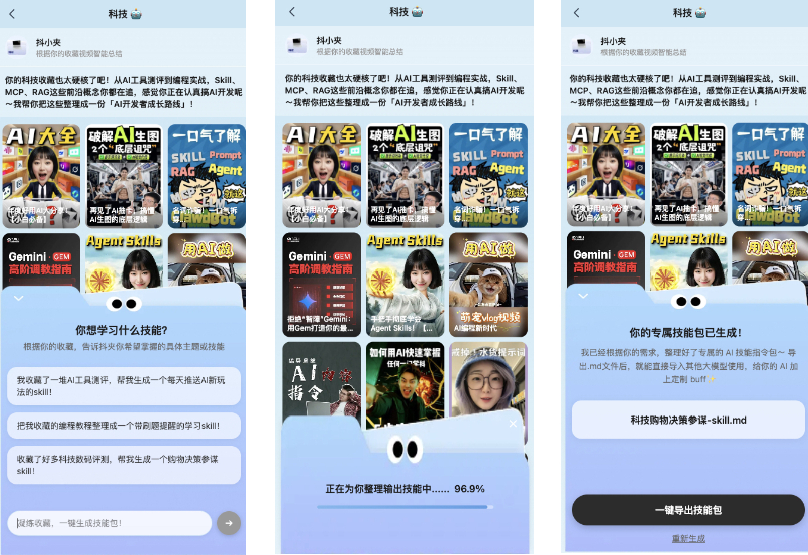

# FavToSkill - 收藏即技能(抖小夹)

> 别让你的收藏吃灰！一键将收藏内容凝练为Skill，让碎片化知识真正为你所用。


## 产品介绍

> 你是否也有这样的困扰——抖音收藏了上百条视频，微信公众号攒了一堆"稍后阅读"，小红书标记了无数好内容……但这些收藏大多再也没有打开过？

**FavToSkill** 就是为了解决这个问题而生。它能自动将你散落在各平台的收藏内容进行 AI 分类整理，构建你的个人知识图谱，并通过 RAG 问答深入理解内容，最终**一键生成Skill 文件**——让你积累的碎片知识变成真正可执行、可复用的 AI 技能。



## 核心功能

### 1. 智能分类 · 知识图谱
- AI 自动将收藏内容分类为科技、美食、旅行、影视解说、人文知识、游戏等领域
- 可视化知识地图，直观展示你的知识版图
- 每个分类配备专属 Bot 角色，提供个性化引导

### 2. RAG 智能问答
- 基于收藏内容的检索增强生成（RAG）对话
- 支持中文分词的加权关键词检索（标题 5x / 标签 3x / 描述 2x / 字幕 1x）
- 流式 AI 响应，实时输出，体验流畅
- 内置 LLM 响应缓存，优化性能与成本

### 3. Skill 一键生成
- 从收藏内容中提炼知识，一键生成符合 Claude Code 规范的 `SKILL.md` 文件
- 支持 AI 结构化生成（Zod Schema 约束）与模板兜底双模式
- 生成的 Skill 包含：使用场景、核心能力、示例、约束条件、知识来源等完整结构
- 一键导出下载，即刻在 Claude Code 中使用



## 技术实现

| 层级 | 技术选型 | 说明 |
|------|---------|------|
| 框架 | **Next.js 16** (App Router) + **React 19** | 全栈框架，SSR + API Routes |
| 语言 | **TypeScript 5** | 全量类型安全 |
| 样式 | **Tailwind CSS v4** | 原子化 CSS + 自定义 CSS 变量设计体系 |
| AI SDK | **Vercel AI SDK** + **LangChain.js** | streamText / generateObject 流式生成 |
| LLM | **通义千问 qwen3.5-plus**（DashScope API） | OpenAI 兼容协议接入 |
| 数据校验 | **Zod v4** | Skill 生成结构化输出约束 |
| 向量数据库 | **ChromaDB**（规划中） | Phase 2 语义检索能力 |
| 部署 | **Netlify** | 一键部署，Standalone 输出模式 |

**系统架构概览：**

```
用户收藏内容 → AI 智能分类 → 知识图谱展示
                                    ↓
                            RAG 检索增强问答
                                    ↓
                         Claude Code Skill 生成 → 导出使用
```

## 关于 Demo 数据

> 本项目诞生于黑客松，由于时间紧张，加之抖音平台对收藏内容存在严格的反爬机制，当前版本使用 **Demo 模拟数据** 进行功能演示，旨在完整展示产品核心流程与交互体验。

## 未来规划

我们的愿景是打造一个 **跨平台收藏内容聚合管理 + AI 技能生成** 平台：

- **多平台收藏导入**：接入抖音、微信公众号精选、小红书、Bilibili、知乎收藏等主流内容平台
- **统一收藏管理**：一个入口管理你散落各处的收藏内容，告别信息孤岛
- **Skill 市场**：用户生成的 Skill 可分享、可发现，构建社区知识生态
- **个性化知识体系**：基于长期收藏行为，构建你独一无二的知识画像

**将你在任何平台的收藏内容凝练提纯，一键生成你想要的Skill——这就是 FavToSkill 的终极目标。**

## 快速开始

```bash
cd src
cp .env.example .env.local   # 配置环境变量（可选，无 API Key 自动使用 Mock 模式）
npm install
npm run dev
```

访问 [http://localhost:3000](http://localhost:3000) 体验完整功能。

## Together

这是一个充满想象力的开源项目，我们欢迎所有感兴趣的开发者一起参与共建！

无论你擅长前端交互、AI/RAG 管线、爬虫与数据采集、还是产品设计，都欢迎加入我们，一起让「收藏吃灰」成为历史。

欢迎通过 Issue 或 PR 参与贡献，期待与你一起打造下一代个人知识管理工具！

---

